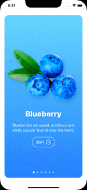
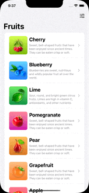
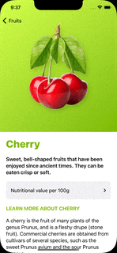
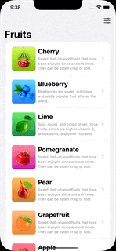

#Fructus is fruits virtual library!

##Features:
- SwuftUI & iOS 14
- SwiftUI animations.
- Onboarding screen with page carousel (Page Tab View)
- Storing the state of the app in App Storage
- List of fruits
- Detail page for every fruit
- Links
- Disclosure view
- Settings screen with reset function.

